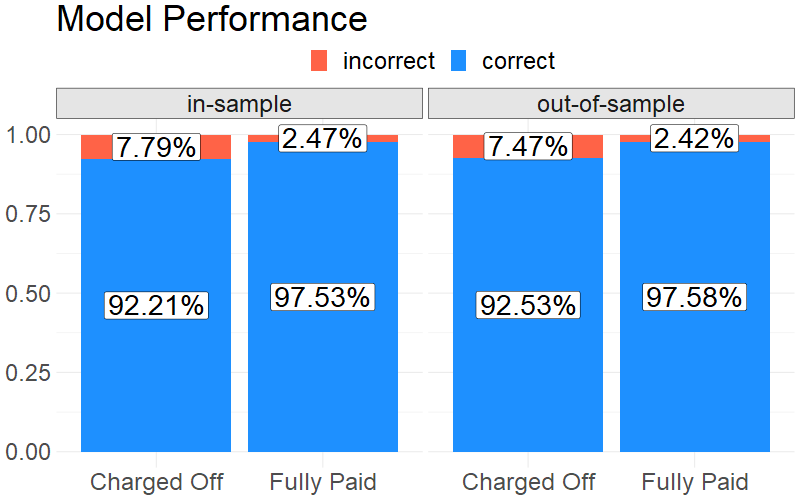

# Predicting Defaults of Consumer Loans

## Summary
* Data source: historical performance of Lending Club consumer loans 
* Model type: logistic regression
* Performance: 92.53% true positive rate/97.58% true negative rate; 97.86% AuC

## Model Evaluation
Overall, the model is expected to correctly predict 92.53% of the charged-off cases and 97.58% of the fully-paid cases. In other words, given a new loan application, the model will label it as charged-off 92.53% of the time if it defaults eventually, or label it as fully-paid 97.58% of the time if it does get paid off eventually.

  

The model also has an out-of-sample AuC of 97.86%, indicating a strong ability to separate the two classes on the scale of 0% (terrible model) to 100% (perfect model).

  

Being a logistic regression model, it attempts to establish a connection between various loan attributes and the probability of default. Total payment received, total borrowed amount and whether the borrower is on a hardship plan turn out to be the 3 most important factors in the model.

## The Process Explained

Logistic regression is chosen for its simplicity, efficiency and suitability in a binary classification setup. To kick things off, data concerning the two cases in question is divided into the training set (80%) for fitting the model and the testing set (20%) for evaluating its performance. To address the imbalanced nature of the data, the minority class (default) is also oversampled before feeding the data into the optimizer.

On the other hand, data preparation/variable selection lies at the heart of the model-building process. As the first step, any variable that doesn't appear add value were excluded from the data set, e.g., numerical variables that have 0 variance, categorical variables that have only 1 case, or variables with too many missings (>90%). After that, missing numerical values are replaced with median and categorical variables are converted to dummies. Finally, of the remaining variables, subjective judgment (based prior knowledge of what tends to correlate with a default) and variable importance (as indicated by z-stats) are the two decision criteria in forming the final specification of the model. 

## Future Work

There are three potential areas for improvement. First, other models known to perform well in binary classification can be tested, e.g., decision tree, random forest or support vector machine. Secondly, certain date-like variables, while not super useful on their own, can be further tuned/transformed to become useful features, e.g., turning them into time since the date. Last but not least, the data preparation and scoring part of the script needs to rewritten in a robust and reliable manner before going into production to account for error handling/edge cases.
